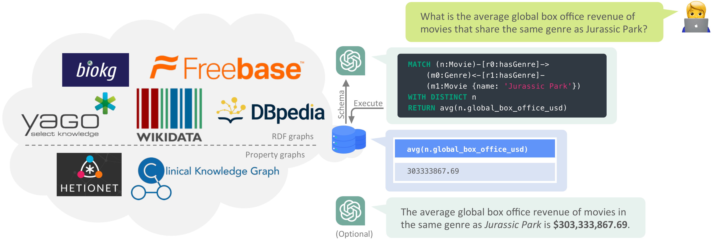

# 🔑 CypherBench

[](LICENSE) 
[](https://huggingface.co/datasets/megagonlabs/cypherbench)
[](https://arxiv.org/pdf/2412.18702)
[](https://browser.neo4j.io/?dbms=neo4j%2Bs%3A%2F%2Fneo4j@36535562.databases.neo4j.io&db=neo4j)

> CypherBench: Towards Precise Retrieval over Full-scale Modern Knowledge Graphs in the LLM Era <br/>
> Yanlin Feng, Simone Papicchio, Sajjadur Rahmanα



## 🔥 Updates

- [Feb 20, 2025] We updated the graph deployment configuration to reduce RAM usage.
- [Feb 19, 2025] We have released the evaluation scripts and the EX and PSJS implementations!
- [Feb 14, 2025] We have released the text2cypher baseline code! See the instructions below on how to run `gpt-4o-mini` on CypherBench.
- [Feb 13, 2025] The [11 property graphs](https://huggingface.co/datasets/megagonlabs/cypherbench/tree/main/graphs) are now available on 🤗HuggingFace! We also make it super easy to deploy them (see the instructions below).
- [Dec 27, 2024] We have deployed a [demo NBA graph](https://browser.neo4j.io/?dbms=neo4j%2Bs%3A%2F%2Fneo4j@36535562.databases.neo4j.io&db=neo4j)(password: `cypherbench`) at Neo4j AuraDB! Check it out! You can run Cypher queries like `MATCH (n:Player {name: 'LeBron James'})-[r]-(m) RETURN *`.
- [Dec 27, 2024] The [training and test sets](https://huggingface.co/datasets/megagonlabs/cypherbench) are now available on 🤗HuggingFace! 


## 🚀 Quickstart

### 1. Installation


```bash
conda create -n cypherbench python=3.11
conda activate cypherbench

git clone https://github.com/megagonlabs/cypherbench.git
cd cypherbench
pip install -e .
```

### 2. Download the dataset

To download the dataset (including both the graphs and text2cypher tasks), simply clone the [HuggingFace dataset repository](https://huggingface.co/datasets/megagonlabs/cypherbench):

```bash
# Make sure you have git-lfs installed (https://git-lfs.com)
git lfs install

# Clone the dataset repo from HuggingFace and save it as the `benchmark` directory
git clone https://huggingface.co/datasets/megagonlabs/cypherbench benchmark
```

### 3. Deploy the graphs using Docker

⚠️ Deploying the graphs requires significant memory. We recommend using a machine with at least 64GB of RAM when deploying the 7 test graphs and 128GB when deploying all 11 graphs. Additionally, ensure that Docker is installed before proceeding.

Now, you can deploy the 7 test graphs with a single Docker Compose command using our [custom Neo4j Docker image](https://hub.docker.com/repository/docker/megagonlabs/neo4j-with-loader/general) and our [Docker Compose configuration](docker/docker-compose-test.yml):

```bash
cd docker/
bash start_neo4j_test.sh  #  This script first checks if required files exist, then runs the docker-compose command
cd .. 

# check if the graphs are fully loaded (it typically takes at least 10 minutes).
python scripts/print_db_status.py
```

To stop the Neo4j databases, run `bash stop_neo4j_test.sh`.

### 4. Run `gpt-4o-mini` on CypherBench

Running `gpt-4o-mini` on the CypherBench test set costs around $0.3. First, make sure you have set the `OPENAI_API_KEY` environment variable to use the OpenAI API.

```bash
python -m cypherbench.baseline.zero_shot_nl2cypher --llm gpt-4o-mini --result_dir output/gpt-4o-mini/
```

There are two ways to fetch the graph schemas when running text2cypher:
- (default) `--load_schema_from json` loads the schema from the local JSON files stored in [the benchmark/graphs/schemas directory](https://huggingface.co/datasets/megagonlabs/cypherbench/tree/main/graphs/schemas). When using this option, the Neo4j databases are not used during text2cypher.
- `--load_schema_from neo4j` fetches the schema from the Neo4j database by executing special Cypher queries*. This option requires the Neo4j databases to be fully loaded.

*We don't use apoc.meta.data() by default, see Appendix A.4 in the paper for details.

### 5. Evaluate metrics

```bash
python -m cypherbench.evaluate --result_dir output/gpt-4o-mini/  --num_threads 8  # Adjust the number of threads as needed
```

Metric implementation:
- Execution Accuracy (EX): [execution_accuracy.py](cypherbench/metrics/execution_accuracy.py)
- Provenance Subgraph Jaccard Similarity (PSJS): [provenance_subgraph_jaccard_similarity.py](cypherbench/metrics/provenance_subgraph_jaccard_similarity.py)
- Executable Percentage: [executable.py](cypherbench/metrics/executable.py)


Reference performance for `gpt-4o-mini`:

```
{
  "overall": {
    "execution_accuracy": 0.3143,
    "psjs": 0.4591,
    "executable": 0.8739
  },
  "by_graph": {
    "flight_accident": 0.4603,
    "fictional_character": 0.3273,
...
```

## 📅 Future Release Plan

- [x] text2cypher tasks
- [x] 11 property graphs and graph deployment docker
- [x] text2cypher baseline code
- [x] EX/PSJS implementation and evaluation scripts
- [ ] Wikidata RDF-to-property-graph engine
- [ ] Text2cypher task generation pipeline

Please feel free to open an issue if you have any questions or suggestions!

## 📚 Citation

```
@article{feng2024cypherbench,
  title={CypherBench: Towards Precise Retrieval over Full-scale Modern Knowledge Graphs in the LLM Era},
  author={Feng, Yanlin and Papicchio, Simone and Rahman, Sajjadur},
  journal={arXiv preprint arXiv:2412.18702},
  year={2024}
}
```